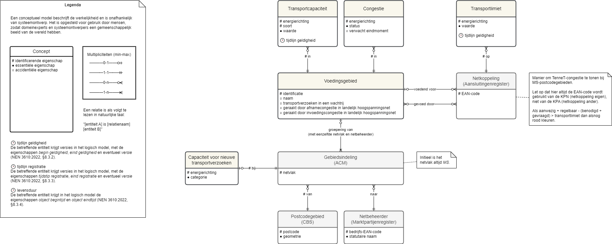

# Informatiemodel voor de NBNL-capaciteitskaart.

## Capaciteit voor nieuwe transportverzoeken

transportcapaciteit beschikbaar om nog niet ingediende transportverzoeken uit
te voeren.

* categorie: onderdeel van een rangschikking
* beschikbaar: de netbeheerder verwacht geen tekort aan transportcapaciteit
* beperkt beschikbaar: de netbeheerder verwacht geen tekort aan
  transportcapaciteit maar nieuwe transportverzoeken vereisen mogelijk
  onderzoek om de gevraagde en beschikbare transportcapaciteit met elkaar in
  overeenstemming te brengen
* in onderzoek: de netbeheerder onderzoekt de mogelijkheden voor de toepassing
  van congestiemanagement zodat er mogelijk transportcapaciteit beschikbaar
  komt
* tekort: er is te weinig transportcapaciteit
* energierichting: kant waarop energie beweegt
* afname: onttrekking van energie aan het energienet
* invoeding: inbrenging van energie op het energienet

## Congestie

Situatie waarin de te verwachten behoefte aan transport redelijkerwijs kan
leiden tot een structureel tekort aan transportcapaciteit.

* energierichting: kant waarop energie beweegt
* afname: onttrekking van energie aan het energienet
* invoeding: inbrenging van energie op het energienet
* status: toestand waarin een congestie zich bevindt
* vooraangekondigd: toestand waarin de netbeheerder door middel van een
  vooraankondiging als bedoeld in artikel 9.9 van de Netcode elektriciteit
  (geldend van 20-2-2024) een mogelijk tekort aan beschikbare
  transportcapaciteit heeft gemeld zonder dat deze vooraankondiding is komen te
  vervallen en waarbij het onderzoek als bedoeld in artikel 9.10 van de Netcode
  elektriciteit (geldend van 20-2-2024) nog niet is gepubliceerd
* actief: toestand waarin de netbeheerder na publicatie van een onderzoek als
  bedoeld in artikel 9.10 van de Netcode elektriciteit (geldend van 20-2-2024)
  congestiemanagement toepast
* verwacht eindmoment (datum): moment waarop naar verwachting geen sprake meer
  zal zijn van congestie

## Gebiedsindeling:

Een toewijzing van een gebied aan een netbeheerder waarbinnen deze de
wettelijke taak inzake aansluiten verricht
(https://wetten.overheid.nl/BWBR0037943) netvlak: deel van het net waarvoor
geldt dat de verbruikers aangesloten op dit deel van het net eenzelfde tarief
in rekening krijgen.

* EHS: extra hoogspanning (≥ 220 kV of afwijkende grens per netbeheerder)
* HS: hoogspanning (≥ 110 kV en < 220 kV of afwijkende grenzen per
  netbeheerder)
* TS: tussenspanning (≥ 25 kV en < 110 kV of afwijkende grenzen per
  netbeheerder)
* MS: middenspanning (> 1 kV en < 25 kV of afwijkende grenzen per netbeheerder)
* LS: laagspanning (≤ 1 kV of afwijkende grenzen per netbeheerder)

## Netbeheerder

Vennootschap die op grond van de wet is aangewezen voor het beheer van een of
meer energienetten, niet zijnde gesloten distributiesystemen.

* bedrijfs-EAN-code: identificatienummer van een onderneming conform de
  Europese Artikel Nummering
* statutaire naam: eerste handelsnaam van een onderneming zoals geregistreerd
  in een register van ondernemingen

## Netkoppeling

Recht op het gebruik van één of meer verbindingen tussen twee energienetten of
tussen een energienet en een interconnector.

* EAN-code: identificatie van een netkoppeling

## Postcodegebied

Indeling bedoeld als hulpmiddel bij de bezorging van post.

* geometrie (multivlak): tweedimensionale geometrische representatie van het
  vlak dat wordt gevormd door de omtrekken van een postcodegebied
* postcode (PC6): reeks tekens om het automatisch sorteren van post
  gemakkelijker te maken

## Transportcapaciteit

Vermogen om een energiedrager te verplaatsen.

* energierichting: kant waarop energie beweegt
* afname: onttrekking van energie aan het energienet
* invoeding: inbrenging van energie op het energienet
* soort: groep dingen met gemeenschappelijke kenmerken
* aanwezige transportcapaciteit: maximale capaciteit dat een energienet aankan,
  met inachtneming van de van toepassing zijnde netontwerpcriteria en
  operationele veiligheidsgrenzen
* benodigde transportcapaciteit: transportcapaciteit nodig om
  transportovereenkomsten uit te voeren
* gevraagde transportcapaciteit: transportcapaciteit nodig om
  transportverzoeken uit te voeren
* regelbaar vermogen
* geraamde benodigde transportcapaciteit voor de totale behoefte aan transport
* waarde: aantal MW of m3(n)/uur

## Voedingsgebied

Geografisch afgebakend gebied waar zich de overdrachtspunten van aansluitingen
bevinden die van energie worden voorzien door een bepaald netelement.

* geraakt door afnamecongestie in landelijk hoogspanningsnet (ja, nee)
* geraakt door invoedingscongestie in landelijk hoogspanningsnet (ja, nee)
* identificatie: reeks karakters toegewezen aan een voedingsgebied om deze
  ondubbelzinnig te herkennen en onderscheiden van andere voedingsgebieden van
  dezelfde netbeheerder
* naam: woord of groep van woorden ter aanduiding van een voedingsgebied
* transportverzoeken in een wachtrij (natuurlijk getal): aantal
  transportverzoeken binnen een voedingsgebied dat in een wachtrij staat
