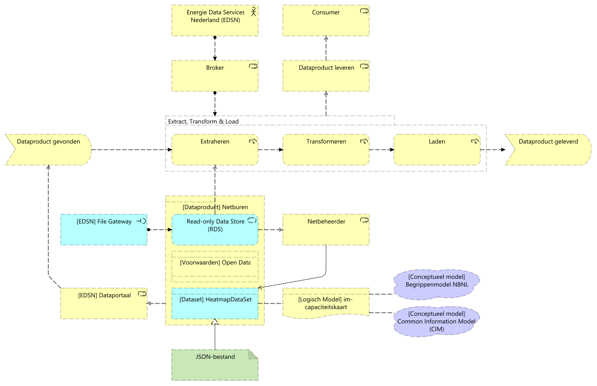

# Inleiding

Dit ontwerp beschrijft de beoogde gebruiksscenarios voor het dataproduct
*Capaciteitskaart*, alsmede de achterliggende architectuur en gemaakte keuzes.

# Reikwijdte

De [capaciteitskaart](https://capaciteitskaart.netbeheernederland.nl/) van
Netbeheer Nederland consolideert en publiceert capaciteitsinformatie van de
gezamelijke netbeheerders (TSO & DSO) van Nederland. Hiervoor levert elke
netbeheerder een overzicht van voedingsgebieden en corresponderende
capaciteits- en projectinformatie.

Dit ontwerp beschrijft het proces om tot ontsluiting van het bijbehorende
dataproduct te komen en de betekenis & structuur van het dataproduct.

# Achtergrond

Onderstaand wordt kort de achtergrond toegelicht m.b.t. dataproducten.

## Dataproduct

Voor alle data-uitwisseling binnen de scope van de visie is expliciet gekozen
voor het denken over data in de vorm van dataproducten. Een dataproduct
combineert de semantische-, technische- en gebruiksaspecten van
data-uitwisseling. Om dit invulling te geven bestaat een dataproduct uit de
volgende componenten:

* *dataset*: de daadwerkelijke gegevens die worden uitgewisseld. Zie een dataset
  als een tabel met gegevens, waarbij de kolommen beschrijven wat er op elke
  rij van de data aan gegevens wordt geleverd. Een dataset voor aansluitingen
  zal minstens een kolom "Aansluitingsnummer" bevatten, waarbij elke rij in de
  dataset een aansluiting beschrijft;
* *dataservice*: de technische manier van verspreiden van de dataset. Dit gaat
  over hoe de data ontsloten wordt (als bestand, API, database of *file
  server*);
* *voorwaarden*: er kunnen voorwaarden liggen op beschikbaarheid, kwaliteit,
  classificatie en doelbinding bij gebruik van het dataproduct.

Het dataproduct combineert de *dataset* en *dataservice*, verrijkt met
*voorwaarden* voor gebruik.

## Volume, variety, veracity, velocity

Data kent vier kenmerken:

* *volume*: data kent een volume, een hoeveelheid;
* *variety* (variëteit): data is te verdelen in gestructureerde en
  ongestructureerde data. Ongestructureerde data kent geen metamodel;
* *veracity* (betrouwbaarheid): de mate waarin de data vertrouwd kan worden
  voor de toepassing;
* *velocity* (snelheid): de frequentie waarmee data verandert.

# Dataservice

## Gebruiksscenario

Het volgende gebruiksscenario wordt ondersteund:

1. TenneT levert een dataset met voedingsgebieden gebaseerd op onderstation
   (OS). Deze dataset bevat EnergyArea-s, maar geen PostcodeArea-s
2. EDSN levert deze dataset door aan elke Regionale Netbeheerder (RNB) als
   basis voor de invulling van de voedingsgebieden
3. Elke individuele RNB levert de dataset met de voedingsgebieden voor haar
   dekkingsgebied aan bij *Energie Data Services Nederland* (EDSN). Hierbij
   worden worden voedingsgebieden -waar mogelijk- gekoppeld aan de
   voedingsgebieden van TenneT
4. EDSN consolideert de aangeleverde datasets en visualiseert deze op een
   interactive, geografische kaart. De geconsolideerde (uit alle aanleveringen
   samengevoegde) dataset wordt integraal aangeboden als downloadbaar bestand
   (dataproduct)
5. EDSN bevestigt de ontvangst van de dataset en de publicatie van de kaart
6. Een gebruiker vraagt de kaart op, via een browser
7. De kaart wordt getoond aan de gebruiker

## Architectuur

Vanuit architectuurperspectief zijn de volgende keuzes gemaakt:

* de structuur (logisch model) van de dataset is gebaseerd op het [conceptuele
  model Begrippenmodel NBNL](https://begrippen.netbeheernederland.nl/) en het
  [Common Information Model](https://cim-mg.ucaiug.io/latest/);
* aanlevering van de dataset vanuit de netbeheerder geschiedt via JSON-bestand.
  Een [JSON Schema]() op basis van het logisch model wordt hiervoor beschikbaar
  gemaakt;
* netbeheerders leveren de dataset aan via de *File Gateway* van EDSN;
* het dataproduct *Capaciteitskaart* is vindbaar via het EDSN Dataportaal.

# Dataset

De dataset beschrijft capaciteits- en wachtrij-informatie voor de
[voedingsgebieden](https://netbeheer-nederland.github.io/im-capaciteitskaart/EnergyArea/),
[bijbehorende
postcodes](https://netbeheer-nederland.github.io/im-capaciteitskaart/PostcodeArea/)
en
[werkzaamheden](https://netbeheer-nederland.github.io/im-capaciteitskaart/Work/)
die invloed hebben op de beschikbare capaciteit.

## Prognose

Bij een meerjarige prognose wordt een aparte dataset (als JSON-bestand) per
jaar opgeleverd door de netbeheerder. Hiermee kan de verschuiving in
beschikbare capaciteit worden geduid, naast verschuivingen in voedingsgebieden.
De bijbehorende
[metadata](https://netbeheer-nederland.github.io/im-capaciteitskaart/HeatmapDataSet/)
specificeert voor welk jaar de dataset van toepassing is.

## Volume, variety, veracity, velocity

| Type     | Beschrijving                                                                                               |
|----------|------------------------------------------------------------------------------------------------------------|
| Volume   | Laag, < 100MB (ongecomprimeerd).                                                                           |
| Variety  | Gestructureerd.                                                                                            |
| Veracity | Hoog, sluit aan op bestaande congestie/capaciteitsinformatie.                                              |
| Velocity | driemaandelijkse update voor capaciteitsinformatie en werkzaamheden, maandelijks voor wachtrij-informatie. |

# Voorwaarden

Dit dataproduct wordt als [open
data](https://github.com/Netbeheer-Nederland/am-doelarchitectuur-datadelen/blob/cebef14d35eaedd808cf9cb9ec7e931d0c5178c3/assets/20230217_NBNL_T5_Visie%20op%20datadelen_V1.01.pdf)
aangeboden.

# Beslissingen en aannames

| Type       | Beschrijving                                                                                       |
|------------|----------------------------------------------------------------------------------------------------|
| Beslissing | Een voedingsgebied bestaat uit een of meerdere postcodegebieden.                                   |
| Beslissing | Voor elk jaar (tot 2030) wordt een aparte dataset per jaar opgeleverd.                             |
| Aanname    | Het dataproduct wordt opgevoerd in het EDSN Dataportaal.                                           |
| Aanname    | Voedingsgebieden zijn **niet** stabiel over de tijdsperiode voor prognoses.                        |
| Aanname    | Op een later moment wordt mogelijk een ander integratiepatroon gehanteerd, zoals *Apache Iceberg*. |
